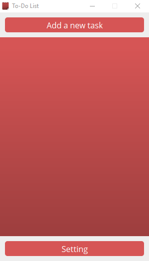

# To-Do List

- EN -
This To-Do List is a training application for me, the main purpose is that you can add multiple task (max 9 for the moment) mark them as done and delete them. You have also the possibility to change the colors, the language and clear the task list. The tasks, the colors and the position of the frame are saved so you don't have to replace it where you want at each start. I certainly gonna do some extra update so stay tuned ;)

- FR -
Cette "To-Do List" est une application d'entrainement pour moi, le principal but est de pouvoir ajouter de multiple tâche (9 max pour le moment) les marquer comme complétées et les supprimer. Vous avez aussi la possibilité de changer les couleurs, le langage et de vider la liste. Les tâches, les couleurs et la position de la fenêtre sont sauvegardées de cette façon il est inutile de la replacer à chaque lancement. Je vais certainement faire des mises à jour supplémantaire alors restez à l'écoute :D

